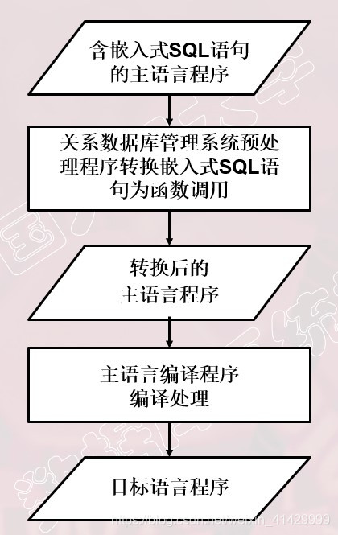
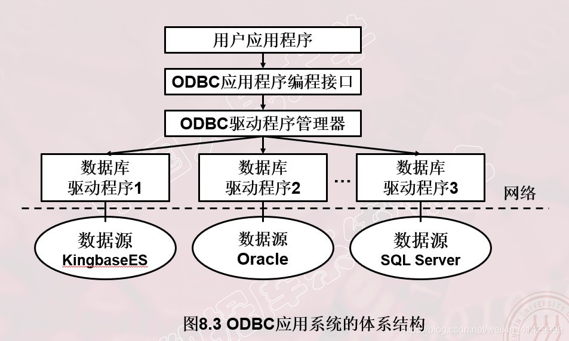
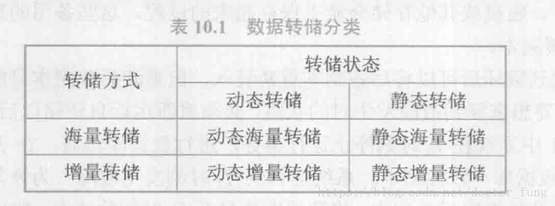
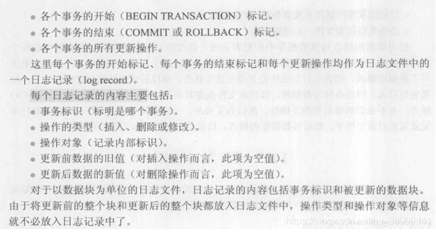
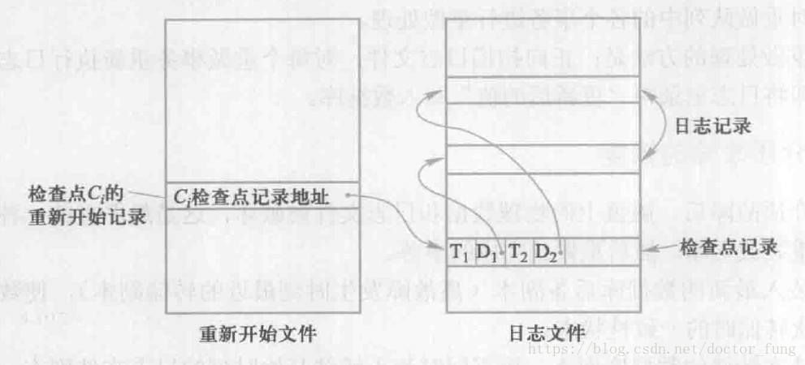
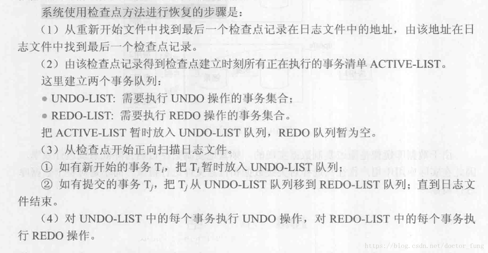

# 8. 数据库编程

SQL缺少流程控制能力，难以实现业务应用中的逻辑控制；SQL编程技术可以有效地克服SQL语言实现复杂应用方面的不足，提高应用系统和数据库管理系统之间的互操作性。

使用SQL编程来访问和管理数据库中数据的方式主要有：嵌入式SQL（ESQL），过程化SQL（PL/SQL），储存过程和自定义函数，开放数据库连接（ODBC）等。。。

## 8.1 嵌入式SQL

SQL的特点之一就是可以在交互式和嵌入式两种不同的使用方式下工作。

### 8.1.1 嵌入式SQL的处理过程

被嵌入的语言，如Java，被称为**宿主语言**。

嵌入式SQL的基本处理过程：



在嵌入式SQL中，为了能够快速区分SQL语言与主语言，所有SQL语句都必须加前缀，对于C语言，格式为：

```cpp
EXEC SQL </*SQL语句*/>;
```

对于Java，格式为：

```java
# SQL {</*SQL语句*/>};
```

### 8.1.2 嵌入式SQL与主语言之间的通信

数据库工作单元与源程序工作单元之间的通信主要包括：

1. 向主语言传递SQL语句的执行状态信息，给主语言提供控制流程的依据，这部分主要由SQL通信区（SQLCA）来实现
2. 主语言向SQL语句提供参数，主要用主变量（host variable）实现
3. 将SQL语句的查询结果提交给主语言处理，主要用主变量和游标实现（cursor）

- **SQL通信区**

  SQL语句执行过后，需要返回主程序若干信息，包括当前的工作状态和各种运行环境的数据等，这些信息将被送到SQL通信区中，应用程序将从SQL通信区中读取这些信息作为流程控制的依据。

  SQL通信区使用`exec sql include sqlca`加以定义，其中有一个变量`sqlcode`，用来存放每次执行SQL之后返回的代码。

  应用程序每执行一次SQL就应检查一下sqlcode的值（success，其他）

- **主变量**

  嵌入式SQL中可以使用主语言程序中的变量来输入或者输入数据；

  SQL语句中使用的主语言程序变量称为**主变量**；

  根据作用不同分为输入主变量（主程序赋值，SQL引用）和输出主变量（同理）；

  一个主变量可以附带一个任选的**指示变量**（indicator variable），为一个整数变量，用来指示其所属的主变量的值或者条件，例如只是或者检测主变量是否为空；

  所有主变量必须在`begin decalre section`和`end declare section`之间进行说明，说明之后，主变量就可以在SQL语句中任何可以使用表达式的地方出现，为了与**数据库对象名**（表名，列名等）区分，嵌入式SQL语句中的主变量和指示变量都要在前面加上冒号；

- **游标**

  SQL语言面向集合，一条SQL语句可以返回多条记录；
  主语言一般是面向记录的，一次只能处理一条记录；

  为了协调，ESQL引入了**游标**的概念；

  游标是系统为用户开设的一个数据缓冲区，存放SQL的执行结果，每一个游标区都有自己的名字，用户可以通过游标逐一获得记录并进行处理。

- **建立和关闭数据库连接**

  - **建立数据库连接**

    ```cpp
    exec sql connect to target[AS connection-name][USER user-name]
    ```

    **target**：要连接的数据库服务器，可以是像`<dbname>@<hostname>:<port>`一样的服务器表示串，还可以是DEFAULT，还可以是包含服务器标识的SQL串常量。

    **connection-name**：可选的连接名，用来识别程序内建立的多个数据库连接，如果程序内只有一个数据库连接，也可以不指定。

  - **关闭数据库连接**

    ```cpp
    exec sql disconnect[connection];
    ```

- **程序实例**

  ```cpp
  EXEC SQL BEGIN DECLARE SECTION; /*主变量说明开始*/
  char Deptname[20];
  char Hsno[9];
  char Hsname[20];
  char Hssex[2];
  int HSage;
  int NEWAGE;
  EXEC SQL END DECLARE SECTION; /*主变量说明结束*/
  long SQLCODE;
  EXEC SQL INCLUDE SQLCA; /*定义SQL通信区*/
  
  int main(void) /*C语言主程序开始*/
  {
      int count = 0;
      char yn; /*变量yn代表yes或no*/
  
      printf("Please choose the department name(CS/MA/IS): ");
      scanf("%s", deptname); /*为主变量deptname赋值*/
  
      EXEC SQL CONNECT TO TEST @localhost : 54321 USER "SYSTEM" / "MANAGER"; /*连接数据库TEST*/
      EXEC SQL DECLARE SX CURSOR FOR /*定义游标SX*/
          SELECT Sno,
          Sname, Ssex, Sage /*SX对应的语句*/
          FROM Student 
          WHERE SDept = :deptname;
  
      EXEC SQL OPEN SX; /*打开游标SX，指向查询结果的第一行*/
  
      for (;;)          /*用循环结构逐条处理结果集中的记录*/
      {
          EXEC SQL FETCH SX INTO :HSno, :Hsname, :HSsex, :HSage;
  
          /*推进游标，将当前数据放入主变量*/
          if (SQLCA.SQLCODE != 0) /*SQLCODE != 0，表示操作不成功*/
              break;              /*利用SQLCA中的状态信息决定何时退出循环*/
  
          if (count++ == 0)       /*如果是第一行的话，先打出行头*/
              printf("\n%-10s %-20s %-10s %-10s\n", "Sno", "Sname", "Ssex", "Sage");
  
          printf("%-10s %-20s %-10s %-10d\n", "HSno", "Hsname", "Hssex", "HSage"); /*打印查询结果*/
  
          printf("UPDATE AGE(y/n)?"); /*询问用户是否要更新该学生的年龄*/
          do
          {
              scanf("%c", &yn);
          } while (yn != 'N' && yn != 'n' && yn != 'Y' && yn != 'y');
          if (yn == 'y' || yn == 'Y') /*如果选择更新操作*/
          {
              printf("INPUT NEW AGE:");
              scanf("%d", &NEWAGE);   /*用户输入新年龄到主变量中*/
              EXEC SQL UPDATE Student /*嵌入式SQL更新语句*/
                  SET Sage = :NEWAGE
                  WHERE CURRENT OF SX;
          } /*对当前游标指向的学生年龄进行更新*/
      }
      EXEC SQL CLOSE SX;        /*关闭游标SX，不再和查询结果对应*/
      EXEC SQL COMMIT WORK;     /*提交更新*/
      EXEC SQL DISCONNECT TEST; /*断开数据库连接*/
  }
  ```


c语言连接mysql

~~~c++
#include <stdio.h>
#include "mysql.h"

int main(void)
{
	MYSQL mysql;    //一个数据库结构体
	MYSQL_RES* res; //一个结果集结构体
	MYSQL_ROW row;  //char** 二维数组，存放一条条记录
	//初始化数据库
	mysql_init(&mysql);
	//设置编码方式
	mysql_options(&mysql, MYSQL_SET_CHARSET_NAME, "gbk");
	//连接数据库
	mysql_real_connect(&mysql, "localhost", "root", "root", "mfctest", 3306, NULL, 0);
	//查询数据
	mysql_query(&mysql, "select * from book where 书名 like '%C%'");
	//获取结果集
	res = mysql_store_result(&mysql);
	//显示数据
	printf("ID	书名				作者			出版社		出版时间	   售价\n");
	while (row = mysql_fetch_row(res))
	{
		printf("%s	", row[0]);
		printf("%s	", row[1]);
		printf("%s	", row[2]);
		printf("%s	", row[3]);
		printf("%s	", row[4]);
		printf("%s	\n", row[5]);
	}
	//释放结果集
	mysql_free_result(res);
	//关闭数据库
	mysql_close(&mysql);
	return 0;
}
~~~


### 8.1.3 不用游标的SQL语句

以下ESQL语句不需要使用游标：

- 说明性语句
- 数据定义语句
- 数据控制语句
- 查询结果为单条记录的`SELECT`语句
- 非`CURRENT`形式的增删改语句

1. 查询结果为单条记录的`SELECT`语句

   因为查询结果只有一个，只需要一个`into`子句指定存放查询结果的主变量，无需游标。

   **注意事项**：

   1. `into,where,having`中的条件表达式均可以使用主变量；
   2. 为了应对查询结果为空值的情况，会使用到指示变量，当出现空值的时候，指示变量会被赋值负值。
   3. 如果实际结果不为单条记录，将导致错误

2. **非`CURRENT`形式的增删改语句**

   （啥是current形式自行百度解决吧。。。）
   如果是非current形式的增删改语句，无需使用游标，在`update`的`set`子句和`where`子句中均可以使用主变量，`set`子句还可以使用指示变量。

### 8.1.4 使用游标的SQL语句

必须使用游标的SQL语句包括：

1. 查询结果为多条记录的`select`语句；

   使用游标机制将查询结果一条一条的送给主程序处理；

   1. 说明游标

      ```sql
      exec sql declare <游标名> cursor for <select 语句>;
      ```

      此时并不会执行SQL语句；

   2. 打开游标

      ```sql
      exec sql open <游标名>;
      ```

      执行相应的select语句，并将结果放置到缓冲区。

   3. 推进游标指针并获取当前的记录

      ```sql
      exec sql fetch <游标名>
          into <主变量>[<指示变量>][,<指示变量>]...;
      ```

   4. 关闭游标

      ```sql
      exec sql close <游标名>;
      ```

      游标被关闭后就不再与原来的查询结果相关联；

      被关闭的游标可以被再次打开；

2. `current`形式的`update`和`delete`语句；

   在`update`和`delete`中使用如下的子句：

   ```sql
   where current of <游标名>;
   ```

### 8.1.5 动态SQL

前文使用的嵌入式SQL中，主变量、查询目标列等都是固定的，属于**静态SQL**。

如果某些应用需要等到执行时才能够确定需要提交的SQL语句，需要用到**动态SQL**。

动态SQL支持动态组装SQL和动态参数两种形式。

1. 使用SQL语句主变量

   程序主变量包含的内容是SQL语句的内容，称为SQL语句主变量。

2. 动态参数

   使用`(?)`表示SQL语句中的可变元素。

   需要通过`prepare`语句来准备主变量或者`execute`语句来绑定数据。

   *（具体用法见教材）*

## 过程化SQL

### 8.2.1 过程化SQL的快结构

基本的SQL是高度非过程化的语言；

嵌入式SQL借助高级语言实现了过程化；

过程化SQL是对SQL的扩展，使其增加了过程化语句的功能；

过程化SQL程序的基本结构是块，所有的过程化SQL程序都是由块组成的；

块之间可以相互嵌套，每个块完成一个逻辑操作；

### 8.2.2 变量和常量的定义

1. 变量定义

   ```sql
   变量名 数据类型 [[not null] := 初值表达式];
   变量名 数据类型 [[not null] 初值表达式];
   ```

2. 常量的定义

   ```sql
   常量名 数据类型 constant := 常量表达式;
   ```

   必须要赋初值。

3. 赋值语句

   ```sql
   变量名 := 表达式；
   ```

### 8.2.3 流程控制

1. 条件控制语句

   ```sql
   if condition then
       statement1;
   else
       statement2;
   end if;
   ```

   if语句之间可以嵌套

2. 循环控制语句

   1. 最简单的loop语句

      ```sql
      loop
          some_statement;
      end loop;
      ```

   2. while-loop语句

      ```sql
      while condition loop
          some_statement
      end loop;
      ```

   3. for-loop语句

      ```sql
      for count in [reverse] bound1 .. bound2 loop
          some_statement
      end loop;
      ```

3. 错误处理

   教材：请读者根据具体情况处理

## 8.3 存储过程和函数

过程化SQL主要有**匿名块和命名块两种**类型；

前面介绍的是匿名块，每次执行时都需要编译，不会被保存、调用；

过程和函数是命名块，它们被编译和保存在数据库中，称为**持久性储存模块**，可以被反复调用；

### 8.3.1 存储过程

存储过程由过程化SQL书写，被编译和优化后储存在数据库中，使用时只需要调用；

1. 存储过程的优点

   1. 运行效率高
   2. 降低了客户端和服务器端之间的通信量（只需要发送存储过程的名字和参数）
   3. 方便实施企业规则

2. 存储过程的用户接口

   1. 创建存储过程

      ```sql
      create or replace procedure 过程名 ([参数1, 参数2,...])
      as <过程化SQL块>;
      ```

   2. 执行存储过程

      ```sql
      call / perform procedure 过程名 ([参数列表])
      ```

   3. 重命名一个存储过程

      ```sql
      alter procedure name_1 rename to name_2;
      ```

   4. 重新编译一个存储过程

      ```sql
      alter procedure 过程名 compile;
      ```

   5. 删除存储过程

      ```sql
      drop procedure 过程名;
      ```

### 8.3.2 函数

也称为自定义函数；

函数的定义与存储过程类似，但是函数必须指定返回类型；

1. 函数的定义语句格式

   ```sql
   create or replace function 函数名 ([param_1, param_2, ...]) returns <data_type>
   as <过程化SQL块>;
   ```

2. 函数的执行语句格式

   ```sql
   call / select 函数名 ([param_1, param_2, ...]);
   ```

   [这么久了，还没提过这些方括号、尖括号在代码里啥意思，这里放个链接，以防有人不知道](https://blog.csdn.net/zhangjie1989/article/details/53524710)

3. 修改函数

   可以重命名和重编译，和上面的存储过程一样；

## 8.4 ODBC编程

ODBC是啥自行百度

优点：

- 程序可移植性好
- 能同时访问不同的数据库
- 共享多个数据资源

### 8.4.1 ODBC概述

ODBC有两重功效或者说约束力：

1. 规范应用程序开发
2. 规范关系数据库管理系统应用接口

### 8.4.2 ODBC工作原理概述



1. 用户应用程序

   提供用户界面、应用逻辑、事务逻辑；

   ODBC应用程序包含的内容有：

   - 请求连接数据库
   - 向数据源发送SQL语句
   - 为SQL语句执行结果分配存储空间，定义所读取的数据格式
   - 获取数据库操作结果或处理错误
   - 进行数据处理并向用户提交处理结果
   - 请求事务的提交和回滚操作
   - 断开与数据源的连接

2. ODBC驱动程序管理器

   - 包含在ODBC32.DLL中
   - 管理应用程序和驱动程序之间的通信
   - 建立、配置或删除数据源，并查看系统当前所安装的数据库ODBC驱动程序

3. 数据库驱动程序

   提供应用系统与数据库平台的独立性

4. ODBC数据源管理

   数据源是是最终用户需要访问的数据，包含了数据库位置和数据库类型等信息，是一种数据连接的抽象；

### 8.4.3 ODBC API基础

各个数据库厂商的ODBC应用程序编程接口都要符合两方面的一致性：

- API一致性
- 语法一致性

1. 函数概述

   - 分配和释放环境句柄、连接句柄、语句句柄
   - 连接函数（SQLDriverconnect等）
   - 与信息相关的函数（SQLGetinfo、SQLGetFuction等）
   - 事务处理函数（如SQLEndTran）
   - 执行相关函数（SQLExecdirect、SQLExecute等）
   - 编目函数，ODBC 3.0提供了11个编目函数，如SQLTables、SQLColumn等。应用程序可以通过对编目函数的调用来获取数据字典的信息，如权限、表结构等

2. 句柄及其属性

   句柄是32位整数值，代表一个指针；

   分为：

   - 环境句柄
   - 连接句柄
   - 语句句柄
   - 描述符句柄

   1. 每个ODBC应用程序需要建立一个ODBC环境，分配一个环境句柄，存取数据的全局性背景，如环境状态、当前环境状态诊断、当前在环境上分配的连接句柄等；
   2. 一个环境句柄可以建立多个连接句柄，每一个连接句柄实现与一个数据源之间的连接；
   3. 在一个连接中可以建立多个语句句柄，它不只是一个SQL语句，还包括SQL语句产生的结果集以及相关的信息等；
   4. 在ODBC 3.0中又提出了描述符句柄的概念，它是描述SQL语句的参数、结果集列的元数据集合；


1. 数据类型

ODBC定义了两套数据类型，一套是SQL数据类型，一套是C数据类型，两者之间可以相互转换。

### 8.4.4 ODBC工作流程


# 9. 关系查询处理和查询优化

本章介绍查询处理和查询优化；

查询优化一般可以分为代数优化（逻辑优化）和物理优化；

## 9.1 关系数据库系统的查询处理

查询处理的任务是把用户提交的查询语句转化为高效的**查询执行计划**；

### 9.1.1 查询处理的步骤

关系数据库管理系统的查询处理可以分为四个阶段：

- 查询分析
- 查询检查
- 查询优化
- 查询执行

1. 查询分析

   对查询语句进行扫描、词法分析、语法分析；

   从查询语句中识别出语言符号，如SQL关键字、属性名、关系名等，判断查询语句是否符合SQL语法规则，如没有问题，转入下一步处理；

2. 查询检查

   对合法的查询语句进行语义检查；

   即根据数据字典中有关的模式定义检查语句中的数据库对象，如关系名和属性名是否有效；

   如果是对视图进行操作，则要通过**视图消解**将对视图的操作转化为对基本表的操作；

   同时根据数据字典中的用户权限定义和完整性约束定义对用户的存取权限进行检查（这时的完整性检查是初步的】静态的检查）；

   上述检查通过之后，将SQL查询语句转化为内部表示，即等价的关系代数表达式；

   关系数据库管理系统一般用**查询树**（**语法分析树**）来表示关系代数表达式；

3. 查询优化

   - 代数优化：

     按照一定的规则，对关系代数表达式进行等价变换，改变表达式中的操作次序和组合，提高查询效率；

   - 物理优化：

     存取路径和底层操作算法的选择；

     选择的依据可以是基于**规则**、**代价**、**语义**的；

4. 查询执行

   依据优化器得到的查询执行策略生成查询执行计划，由**代码生成器**生成执行这个查询计划的代码，然后加以执行并返回结果；（为什么作者可以把P放的这么高端）

### 9.1.2 实现查询操作的算法示例

本节简单介绍查询操作和连接操作的实现的算法思想（口胡）

1. **选择操作的实现**

   假设有如下语句：

   ```sql
   select * from student where <blablabla>;
   ```

   1. 简单的全表扫描法

      对于规模小的表，简单有效

      对于规模大且选择率较低的表，效率很低

   2. 索引扫描算法

      如果在选择条件中的属性上建立有索引（hash索引和B+树索引），可以先通过索引找到满足条件的元组的指针，再通过元组指针找到元组；

      当选择率较低时，索引扫描的效率较高；

      如果需要查找的元组均匀分布在表中，全表扫描性能更优；

2. **连接操作的实现**

   **连接操作是查询处理中最常用也是最耗时的操作之一**；

   这里通过简单介绍等值连接（自然连接）简单介绍常见的算法思想；

   e.g.

   ```sql
   select * from Student, SC where Student.Sno = SC.Sno;
   ```

   1. 嵌套循环算法

      传说中的双重循环；

   2. 排序-合并算法

      - 首先对`Student`和`SC`表按`Sno`进行排序；
      - 选取Student中的第一个Sno，依次扫描SC中具有相同Sno的元组，然后连接起来；
      - 当扫描到SC第一个Sno不同的元组时，扫描Student的下一个元组，重复上述步骤；

      一般来说，对于规模比较大的表，使用排序-合并算法执行连接操作总时间会减少；

   3. 索引连接算法

      - 在SC表上建立Sno的索引
      - 对Student中的每一个元组，由Sno的值通过索引找到相应的SC元组，然后连接起来；

   4. hash join 算法

      - 把连接属性作为hash码，用同一个hash函数把Student表和SC表中的元组散列到hash表中
      - 划分阶段(building phase, 也称为partitioning phase)
        - 对包含较少元组的表(如Student表)进行一遍处理
        - 把它的元组按hash函数分散到hash表的桶中
      - 试探阶段(probing phase,也称为连接阶段join phase)
        - 对另一个表(SC表)进行一遍处理
        - 把SC表的元组也按同一个hash函数（hash码是连接属性）进行散列
        - 把SC元组与桶中来自Student表并与之相匹配的元组连接起来

      上面hash join算法前提：假设两个表中较小的表在第一阶段后可以完全放入内存的hash桶中；

## 9.2 关系数据库系统的查询优化

查询优化是影响数据库管理系统性能的关键因素；

### 9.2.1 查询优化概述

查询优化的优点不仅在于**用户不必考虑如何更好地表达查询以获得更高的效率**，而且在于**系统可以比用户程序优化的更好**，这是因为：

- 优化器可以从数据字典中获取信息，做出正确的估算，选择高效的执行计划；
- 在物理统计信息改变的情况下，无需重写程序；
- 优化器可以考虑更多的可行方案；
- 优化其中的技术一般人掌握不了；

在集中式数据库中，查询执行的开销主要包括：**磁盘读取块数（IO代价）**、**处理机时间（CPU代价）**、**内存开销**；

**总代价 = IO代价 + CPU代价 + 内存代价 + 通信代价**

IO代价是总代价的主要部分（磁盘读取设计磁盘的机械操作）；

有时系统选择的方案不是最优的而是较优的；

### 9.2.2 一个实例

```sql
select Student.Sname
from Student, SC
where Student.Sno = SC.Sno and SC.Cno = '2';
```

1. $\Pi_{Sname}(\sigma_{Student.Sno = SC.Sno \land SC.Sno= '2'}(Student \times SC))$

   - 先计算广义笛卡尔积
   - 再进行选择操作
   - 再进行投影操作

2. $\Pi_{Sname}(\sigma_{SC.Cno = '2'}(Student \Join SC))$

   - 先计算自然连接
   - 然后进行选择操作
   - 然后进行投影

   比上一种方法减少了很多读写量；

3. $\Pi_{Sname}(Student \Join \sigma_{SC.Cno = '2'}(SC))$

   - 先进行选择操作
   - 再进行连接操作
   - 最后投影

   代价更小

## 9.3 代数优化

### 9.3.1 关系代数表达式的等价变换规则

1. 连接、笛卡尔积的交换律

   $E1 \times E2 \equiv E2 \times E1$

   $E1 \Join E2 \equiv E2 \Join E1$

2. 连接、笛卡尔积结合律

   $(a \times b) \times c \equiv a \times (b \times c)$

   $(a \Join b) \Join c \equiv a \Join (b \Join c)$

3. 投影的串接定律

   $\Pi_{a1, a2, \cdots, an}(\Pi_{b1, b2, \cdots, bm}(E)) \equiv \Pi_{a1, a2, \cdots, an}(E)$

4. 选择的串接定律

   $\sigma_{F_1}(\sigma_{F_2}(E)) \equiv \sigma_{F_1 \land F_2}(E)$

5. 选择与投影的交换律

   $\sigma_F(\Pi_{a1, a2, \cdots}(E)) \equiv \Pi_{a1, a2, \cdots}(\sigma_F(E))*σ**F*(Π*a*1,*a*2,⋯(*E*))$

6. 选择与笛卡尔积的交换律

   $ \sigma_F(a \times b)=\sigma_F(a)\times b$

7. 选择与并的分配律

   $\sigma_F(a \cup b) \equiv \sigma_F(a) \cup \sigma_F(b)$

8. 选择与差的分配律

   $\sigma_F(a - b) \equiv \sigma_F(a) - \sigma_F(b)$

9. 选择对自然连接的分配律

   $\sigma_F(a \Join b) \equiv \sigma_F(a) \Join \sigma_F(b)$

10. 投影与笛卡尔积的分配律

    $\Pi(a \times b) \equiv \Pi(a) \times \Pi(b)$

11. 投影与并的分配律

    $\Pi(a \cup b) \equiv \Pi(a) \cup \Pi(b)$

### 9.3.2 查询树的启发式优化

1. 选择运算尽可能先做

   因为选择运算影响中间结果的大小

2. 投影运算与选择运算同时进行

   避免重复扫描关系

3. 投影运算与其前后的双目运算符结合起来

4. 对于选择与笛卡尔积结合起来的运算，作为连接运算

5. 找出公共子表达式

## 9.4 物理优化

代数优化不涉及底层的存取路径；

物理优化就是选择高效的操作算法和存取路径；

选择的方法可以是：

- 基于规则的启发式优化；
- 基于代价估算的优化；
- 两者结合；

### 9.4.1 基于启发式规则的存取路径选择优化

1. 选择操作的启发式规则

   对于小关系，全表顺序扫描；

   对于大关系：

   1. 如果查询条件是“主码=值”，查询结果最多为一个元组，可以选择主码索引；
   2. 对于其他情况，估算选择比例，如果较小（低于10%），选择索引，否则，选择全表扫描；
   3. 对于非等值查询或者范围查询，同上依据选择率来决定；
   4. 对于and连接的条件，如果有组合索引，优先采用组合索引；
   5. 对于or，一般全表扫描；

2. 连接操作的启发式规则

   - 如果两个表已经排序，采用排序-合并算法；
   - 如果有索引，可以采用索引连接算法；
   - 如果有一个表较小，采用hash join；
   - 最后可以采用嵌套循环；

### 9.4.2 基于代价估算的优化

启发式规则比较粗糙但是实现简单且并本身代价较小，适合解释型的系统；

在编译型的系统中，可以采用基于代价优化的算法；

1. 统计信息

   数据字典中储存了优化器需要的统计信息，主要包括以下几个方面：

   1. 对于每一个基本表，元组总数、元组长度、占用的块数、占用的溢出块数；
   2. 对基本表的每一个列，不同值的个数、最大值最小值、是否有索引、索引种类；
   3. 对于索引，层数、不同索引值的个数、叶节点数；

2. 实例（略）

# 10. 数据恢复技术

## 10.1 事务的基本概念

**1、事务**

所谓事务是用户定义的一个数据库操作序列，这些操作要么全做要么全不做，是一个不可分割的工作单位。

事务和程序是两个概念，一般一个程序中包含多个事务。如果用户没有显式的定义事务，则DBMS自动划分事务。定义事务的语句一般有三条：

- BEGIN　TRANSACTION
- COMMIT
- ROLLBACK

事务通常是以BEGIN TRANSACTION开始，以COMMIT或ROLLBACK结束，

COMMIT表示提交，即提交事务的所有操作。具体的就是将事务中所有对数据库的更新写回到磁盘上的物理数据库中去，事务正常结束。

ROLLBACK表示回滚，即在事务运行的过程中发生了某种故障，事务不能继续执行，系统将事务中对数据库的所有已完成的操作全部撤销，回滚到事务开始时的状态。

**2、事务的ACID特性**

事务具有4个特性：**原子性，一致性，隔离性和持续性**。

- 原子性：事务中的操作要么都做，要么都不做
- 一致性：事务执行的结果必须是使数据库从一个一致性状态变到另一个一致性状态
- 隔离性：一个事物的执行不能被其他事务干扰，并发执行的各个事务之间不能互相干扰
- 持续性：一个事务一旦提交，它对数据库中数据的改变就应该是永久性的

可能破坏事务ACID特性的因素有：

1. 多个事务并发运行时，不同事务的操作交叉执行
2. 事务在运行过程中被强行停止

## 10.2 数据库恢复概述

数据库的恢复：把数据库从错误状态恢复到某一已知的正确状态

## 10.3 故障的种类

1. 事务故障：运行过程中，由于种种原因，使事务未运行到正常终止点就被撤销。只影响这个事物本身，一般是非预期的，如运算溢出、因为死锁被撤销等，解决方法是强行回滚，称为事务撤销
2. 系统故障（软故障）：造成系统停止运转的任何事件，使得系统重新启动。影响正在运行的所有事务，但不破坏数据库。
   1. 解决方法：清除所有未完成的事务对数据库的所有更改。同时重做所有已提交的事务（因为这些已提交的事务可能还在缓冲区没写到磁盘上的物理数据库上）
3. 介质故障（硬故障）：指外存故障，如磁盘损坏
   1. 解决方法：备份
4. 计算机病毒：产生故障的原因，本身不是故障，可能产生故障2或3

总结各类故障对数据库的影响有两种可能性，一种是数据库本身被破坏，二是数据库没有被破坏，但数据可能不正确。

恢复的基本原理十分简单，可以用一个词概括，**冗余**

## 10.4 恢复的实现技术

建立冗余数据：

- \1. 数据转储
- \2. 登记日志文件

数据库的恢复：把数据库从错误状态恢复到某一已知的正确状态

### 10.4.1 数据转储

静态转储：系统中无运行事务时进行的转储，转储期间不允许任何事务执行。
优点：得到的一定是一个数据一致性的副本
缺点：降低了数据库的可用性

动态转储：转储和用户事务可以并发执行
优点：系统可用性较好
缺点：转储得到的副本不一定一致，因此必须建立日志文件等级转储期间各事务对数据库的修改活动

海量转储：每次转储整个数据库，恢复更方便
增量转储：每次只转储上一次转储后更新过的数据，恢复较复杂




### 10.4.2 登记日志文件

1、日志文件的格式和内容
   两种格式：**以记录为单位/以数据块为单位**
   需要登记的内容：



2、日志文件的作用：是为了记录对数据库中的每一次更新。
   事务/系统故障恢复必须用日志文件
   动态转储必须建立日志文件，后备副本和日志文件结合才能有效地恢复
   静态转储中：


3、 登记日志文件的两条原则
   登记的次序按并发事务执行的时间次序
   必须先写日志文件，后写数据库

**为什么先写日志文件，后写数据库？**

> 把对数据的修改写到数据库中和把表示这个修改的日志记录写到日志文件中是两个不同的操作。有可能在这两个操作之间发生故障，即这两个写操作只完成了一个。
> 如果先写了数据库修改，而在运行记录中没有登记这个修改，则以后就无法恢复这个修改了。如果先写日志，但没有修改数据库，在恢复时只不过是多执行一次UNDO 操作，并不会影响数据库的正确性。所以一定要先写日志文件，即首先把日志记录写到日志文件中，然后写数据库的修改。

## 10.5 恢复策略

### 10.5.1 事务故障的恢复

系统自动完成的，对用户是透明的
**恢复步骤：**
\1. 反向扫描日志文件，查找该事务的更新操作
\2. 对该事务的更新操作执行逆操作
\3. 重复12，直至读到此事务的开始标记

### 10.5.2 系统故障的恢复

系统在重新启动时自动完成的，不需要用户干预
**恢复步骤：**
\1. 正向扫描日志文件，找出故障发生前已经提交的事务（有BEGIN有COMMIT），记入重做事务。同时找出未完成的事务（只有BEGIN），加入撤销队列
\2. 对撤销队列中的事务进行撤销处理：反向扫描并执行逆操作
\3. 对重做队列中的各个事务进行重做处理：正向扫描并重做

### 10.5.3 介质故障的恢复

**恢复方法：**
\1. 装入最新的数据库后备副本，对于动态转储还需同时装入转储开始时刻的日志文件副本
\2. 装入相应的日志文件副本（转储结束时刻的日志文件副本），重做已完成的事务

## 10.6 具有检查点的恢复技术

利用日志技术进行数据库恢复时，恢复子系统必须搜索日志，确定哪些事务需要重做，哪些事务需要撤销，一般需要检查所有日志记录，有两个问题，一是搜索整个日志将耗费大量的时间，二是很多需要重做处理的事务实际上已经将他们的更新操作结果写到了数据库中，然而恢复子系统又重新执行了这些操作，浪费了大量的时间。为了解决这些问题，又发展了具有检查点的恢复技术。这种技术在日志文件中增加了一类新的记录--检查点记录。

检查点记录的内容：
\- 建立检查点时刻所有正在执行的事务清单
\- 这些事务最近一个日志记录的地址




 

\- 重新开始文件记录检查点记录
\- 检查点记录里面记录活跃的事务：T1T2，以及它们的最后日志记录D1D2

恢复方法：



清理日志文件：在重新开始文件里面找到上一个与当前检查点没有相同的活跃事务的检查点，那么它之前的日志记录都可以删掉

日志刷出去了以后系统故障：没问题，因为这个检查点还没写到重新开始文件上，写重新开始文件是最后一步

## 10.7 数据库镜像

用途：

1. 介质故障时将应用迁移到镜像数据库，使数据库可以继续使用，同时恢复著数据库

2. 提供系统并发访问

实际应用中用户往往只对关键数据和日志文件进行镜像

 

# 11. 并发控制

## 11.1. 数据库中为什么要并发控制？并发控制技术能保证事务的哪些特性？

数据库时共享资源，通常有多个事务同时执行。当多个事务同时并发地存取时就会产生同时读/写同一个数据。若对并发操作不加以控制就可能导致存取不正确的数据，破坏事务的一致性。
并发控制保证了事务的一致性和隔离性

## 11.2. 并发操作会产生哪几类数据的不一致？用什么方法可以避免

1. 丢失修改，两个事务对同一个数据同时进行修改，那么就会有一个事务的操作被另一个事务的修改覆盖掉。
2. 不可重复读，一个事务读了某一数据以后，另一个事务对其进行了更新操作，那么再次读的时候就会得到与上次不一样的数据。
3. 读取脏数据，一个事务修改了某一数据并把其写回磁盘，另一个事务读取了这个数据以后，之前那个事务因为某种原因撤销了。

避免不一致性的方法就是并发控制，常用的并发控制有封锁法、时间戳法、乐观控制法、多版本并发控制法等

## 11.3. 什么是封锁？封锁类型有哪几种？

封锁就是事务T对某一数据进行操作前，先向系统发送请求，对其加锁，加锁以后事务就对这个数据有了一定的控制前，在事务T释放锁之前，其他事务不能对该数据进行更新或者读取
封锁类型有：排它锁、共享锁

## 11.4. 三级协议分别能解决哪些问题

1. 加X锁，直到事务结束再释放。解决了丢失修改问题。
2. 在1基础上加S锁，读完后可以释放，解决了读取脏数据的问题。
3. 在1基础上加S锁，直到事务结束再释放，解决了不可重复读问题

## 11.5. 什么是活锁，产生原因和解决办法

当一系列封锁操作无法按照其正确顺序执行时，就可能导致事务无限等待某个封锁。
避免活锁的方法就是使用FCFS

## 11.6. 什么是死锁，解决死锁的办法

举例说明什么是死锁。
防止死锁的方法有两种：预防死锁、死锁诊断与解除
预防死锁有两种办法：一次封锁法、顺序封锁法
死锁诊断与解决：超时法、事务等待图法
解除法：选择处理死锁代价最小的事务，将其解除

## 11.7. 什么样的并发调度是正确的调度

可串行化的并发调度是正确的调度。可串行化调度定义：多个事务并发执行是正确的，当且仅当其结果与按某一次序执行的串行执行的结果相同。

## 11.8. 如何保证并发调度的正确性

冲突可串行化，使用两段锁协议


# 习题：

**1．试述事务的概念及事务的4 个特性。**

事务是用户定义的一个数据库操作序列，这些操作要么全做要么全不做，是一个不可分割的工作单位。
事务具有4 个特性：原子性（Atomicity ）、一致性（consistency ）、隔离性( Isolation ）和持续性（Durability ）。这4 个特性也简称为ACID 特性。
原子性：事务是数据库的逻辑工作单位，事务中包括的诸操作要么都做，要么都不做。
一致性：事务执行的结果必须是使数据库从一个一致性状态变到另一个一致性状态。
隔离性：一个事务的执行不能被其他事务干扰。即一个事务内部的操作及使用的数据对其他并发事务是隔离的，并发执行的各个事务之间不能互相干扰。持续性：持续性也称永久性（Perfnanence ) ，指一个事务一旦提交，它对数据库中数据的改变就应该是永久性的。接下来的其他操作或故障不应该对其执行结果有任何影响。

**2 ．为什么事务非正常结束时会影响数据库数据的正确性，请列举一例说明之。**

事务执行的结果必须是使数据库从一个一致性状态变到另一个一致性状态。如果数据库系统运行中发生故障，有些事务尚未完成就被迫中断，这些未完成事务对数据库所做的修改有一部分已写入物理数据库，这时数据库就处于一种不正确的状态，或者说是不一致的状态。
例如某工厂的库存管理系统中，要把数量为Q 的某种零件从仓库1 移到仓库2 存放。
则可以定义一个事务T , T 包括两个操作；Ql = Ql 一Q , Q2= Q2 + Q。 如果T 非正常终止时只做了第一个操作，则数据库就处于不一致性状态，库存量无缘无故少了Q 。

**3 ．数据库中为什么要有恢复子系统？它的功能是什么？**

因为计算机系统中硬件的故障、软件的错误、操作员的失误以及恶意的破坏是不可避免的，这些故障轻则造成运行事务非正常中断，影响数据库中数据的正确性，重则破坏数据库，使数据库中全部或部分数据丢失，因此必须要有恢复子系统。
恢复子系统的功能是：把数据库从错误状态恢复到某一已知的正确状态（亦称为一致状态或完整状态）。

**4 ．数据库运行中可能产生的故障有哪几类？哪些故障影响事务的正常执行？哪些故障破坏数据库数据？**

数据库系统中可能发生各种各样的故障，大致可以分以下几类：

（1）事务内部的故障；
（2）系统故障；
（3）介质故障；
（4）计算机病毒。
事务故障、系统故障和介质故障影响事务的正常执行；介质故障和计算机病毒破坏数据库数据。

**5 ．数据库恢复的基本技术有哪些？**

数据转储和登录日志文件是数据库恢复的基本技术。
当系统运行过程中发生故障，利用转储的数据库后备副本和日志文件就可以将数据库恢复到故障前的某个一致性状态。

**6 ．数据库转储的意义是什么？试比较各种数据转储方法。**

数据转储是数据库恢复中采用的基本技术。所谓转储即DBA 定期地将数据库复制到磁带或另一个磁盘上保存起来的过程。当数据库遭到破坏后可以将后备副本重新装入，将数据库恢复到转储时的状态。

**静态转储**：在系统中无运行事务时进行的转储操作，如上图所示。静态转储简单，但必须等待正运行的用户事务结束才能进行。同样，新的事务必须等待转储结束才能执行。显然，这会降低数据库的可用性。
**动态转储**：指转储期间允许对数据库进行存取或修改。动态转储可克服静态转储的缺点，它不用等待正在运行的用户事务结束，也不会影响新事务的运行。但是，转储结束时后援副本上的数据并不能保证正确有效。因为转储期间运行的事务可能修改了某些数据，使得后援副本上的数据不是数据库的一致版本。为此，必须把转储期间各事务对数据库的修改活动登记下来，建立日志文件( 109 file ）。这样，后援副本加上日志文件就能得到数据库某一时刻的正确状态。转储还可以分为海量转储和增量转储两种方式。
**海量转储**是指每次转储全部数据库。增量转储则指每次只转储上一次转储后更新过的数据。从恢复角度看，使用海量转储得到的后备副本进行恢复一般说来更简单些。但如果数据库很大，事务处理又十分频繁，则增量转储方式更实用更有效。

**7 ．什么是日志文件？为什么要设立日志文件？**

（1）日志文件是用来记录事务对数据库的更新操作的文件。
（2）设立日志文件的目的是：进行事务故障恢复；进行系统故障恢复；协助后备副本进行介质故障恢复。

**8 ．登记日志文件时为什么必须先写日志文件，后写数据库？**

把对数据的修改写到数据库中和把表示这个修改的日志记录写到日志文件中是两个不同的操作。有可能在这两个操作之间发生故障，即这两个写操作只完成了一个。
如果先写了数据库修改，而在运行记录中没有登记这个修改，则以后就无法恢复这个修改了。如果先写日志，但没有修改数据库，在恢复时只不过是多执行一次UNDO 操作，并不会影响数据库的正确性。所以一定要先写日志文件，即首先把日志记录写到日志文件中，然后写数据库的修改。

**9 ．针对不同的故障，试给出恢复的策略和方法。（即如何进行事务故障的恢复？系统故障的恢复？介质故障恢复？
事务故障的恢复：**
事务故障的恢复是由DBMS DBMs 执行恢复步骤是：

自动完成的，对用户是透明的。

（1）反向扫描文件日志（即从最后向前扫描日志文件），查找该事务的更新操作；
（2）对该事务的更新操作执行逆操作，即将日志记录中“更新前的值”写入数据库；
（3）继续反向扫描日志文件，做同样处理；
（4）如此处理下去，直至读到此事务的开始标记，该事务故障的恢复就完成了。

**系统故障的恢复：**
系统故障可能会造成数据库处于不一致状态：一是未完成事务对数据库的更新可能已写入数据库；二是已提交事务对数据库的更新可能还留在缓冲区，没来得及写入数据库。因此恢复操作就是要撤销（UNDO ）故障发生时未完成的事务，重做（REDO ）已完成的事务。
系统的恢复步骤是：
（1）正向扫描日志文件，找出在故障发生前已经提交的事务队列（REDO 队列）和未完成的事务队列（uNDO 队列）。
（2）对撤销队列中的各个事务进行UNDO 处理。
进行UNDO 处理的方法是，反向扫描日志文件，对每个UNDO 事务的更新操作执行逆操作，即将日志记录中“更新前的值”Before Image ）写入数据库。( 3 ）对重做队列中的各个事务进行REDO 处理。
进行REDO 处理的方法是：正向扫描日志文件，对每个REDO 事务重新执行日志文件登记的操作。即将日志记录中“更新后的值”Afte , Image ）写入数据库。

**介质故障的恢复：**
介质故障是最严重的一种故障。
恢复方法是重装数据库，然后重做已完成的事务。具体过程是：

( 1 ) DBA 装入最新的数据库后备副本（离故障发生时刻最近的转储副本）, 使数据库恢复到转储时的一致性状态；
( 2 ) DBA 装入转储结束时刻的日志文件副本；
( 3 ) DBA 启动系统恢复命令，由DBMS 完成恢复功能，即重做已完成的事务。

**10 ．什么是检查点记录？检查点记录包括哪些内容？**
检查点记录是一类新的日志记录。它的内容包括：
① 建立检查点时刻所有正在执行的事务清单

② 这些事务的最近一个日志记录的地址。

**11 ．具有检查点的恢复技术有什么优点？试举一个具体的例子加以说明。**

利用日志技术进行数据库恢复时，恢复子系统必须搜索日志，确定哪些事务需要REDO ，哪些事务需要uNDO 。一般来说，需要检查所有日志记录。这样做有两个问题：一是搜索整个日志将耗费大量的时间；二是很多需要REDO 处理的事务实际上已经将它们的更新操作结果写到数据库中了，恢复子系统又重新执行了这些操作，浪费了大量时间。
检查点技术就是为了解决这些问题。

在采用检查点技术之前，恢复时需要从头扫描日志文件，而利用检查点技术只需要从T 。开始扫描日志，这就缩短了扫描日志的时间。
事务Tl 的更新操作实际上已经写到数据库中了，进行恢复时没有必要再REDO 处理，采用检查点技术做到了这一点。

**12 ．试述使用检查点方法进行恢复的步骤。**

（1）从重新开始文件（见第11 题的图）中找到最后一个检查点记录在日志文件中的地址，由该地址在日志文件中找到最后一个检查点记录。
（2）由该检查点记录得到检查点建立时刻所有正在执行的事务清单ACTIVE 一LIST 。
这里建立两个事务队列：
1 ) UNDO 一LIST ：需要执行undo 操作的事务集合；
2 ) REDO 一LIST ：需要执行redo 操作的事务集合。
把ACTIVE 一LIST 暂时放入UNDO 一LIST 队列，REDO 队列暂为空。

3 ）从检查点开始正向扫描日志文件：
① 如有新开始的事务T * ，把T ＊暂时放入uNDO 一LlsT 队列；
② 如有提交的事务毛，把毛从UNDO 一LIST 队列移到REDO 一LIST 队列，直到日志文件结束；
4 ）对UNDO 一LIST 中的每个事务执行UNDO 操作，对REDO 一LIST 中的每个事务执行REDO 操作。

**13 ．什么是数据库镜像？它有什么用途？**

数据库镜像即根据DBA 的要求，自动把整个数据库或者其中的部分关键数据复制到另一个磁盘上。每当主数据库更新时，DBMS 自动把更新后的数据复制过去，即DBMS 自动保证镜像数据与主数据的一致性。
**数据库镜像的用途有：**

- 一是用于数据库恢复。当出现介质故障时，可由镜像磁盘继续提供使用，同时DBMS 自动利用镜像磁盘数据进行数据库的恢复，不需要关闭系统和重装数据库副本。
- 二是提高数据库的可用性。在没有出现故障时，当一个用户对某个数据加排它锁进行修改时，其他用户可以读镜像数据库上的数据，而不必等待该用户释放锁。